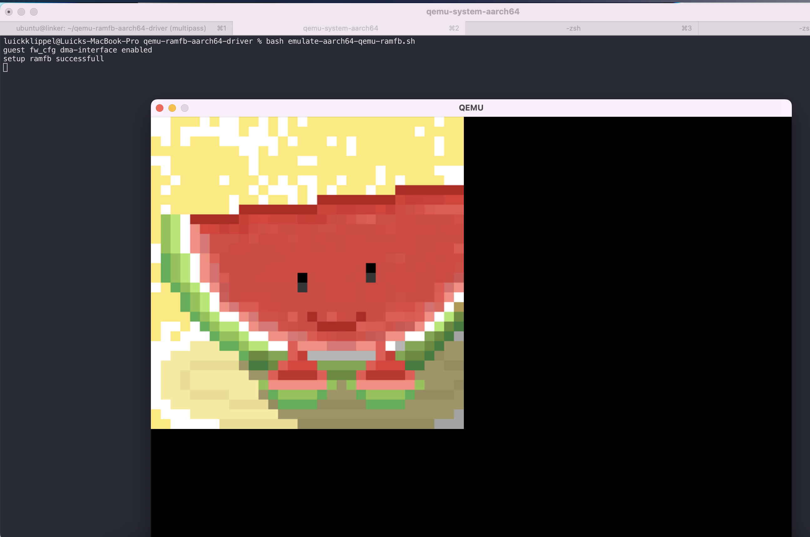

This project is adaptation of [Bare metal Qemu-Ramfb implementation](https://github.com/luickk/qemu-ramfb-aarch64-driver) from aarch64 to riscv64 architecture. I've just rewrote beginning assembly block, changed pors and memory addresses.
Below is an original README.md.

# Bare metal Qemu-Ramfb implementation

This repository came into existance because I had to rewrite parts of the [ZigKernel](https://github.com/luickk/ZigKernel) in C, because the Zig lang in its current version(0.9.1) caused issues/ potentially misscompiles. 

The intent of this project is to provide a driver for bare-metal qemu kernels with Aarch64 architechture wich need a simlpe way of outputting video. With the exception of the SeaBio x86 implementation(and other integrated x86 stacks) there is no such driver for Arm, nor bare metal avaiable yet.
Alternatively there is virtio-gpu which is more complex and therefor not meant for pre-post video or very simple kernel emulation that need to display something.

The most challenging part of this drive implementation was indeed not the code, but finding information and documentation. My main documentation source was a single text file from Qemu which state the basic principles of their guest side dma interface; old qemu/linux kernel/gnu mailing lists, as well as the SeaBios ramfb implementation and the source code from qemu itself.

Resources:
- [Qemu fw_cfg/ guest side dma docs](https://github.com/qemu/qemu/blob/master/docs/specs/fw_cfg.rst)
- [Qemu ramfb implementation](https://github.com/qemu/qemu/blob/master/hw/display/ramfb.c)
- [SeaBios ramfb implementation for x86](https://github.com/coreboot/seabios/blob/master/vgasrc/ramfb.c)
- [Qemu Mailing List](https://patchwork.kernel.org/project/qemu-devel/patch/20180613084149.14523-4-kraxel@redhat.com)
- [RedHat Mailing List(very interesting)](https://bugzilla.redhat.com/show_bug.cgi?id=1679680)

# Setup

The ramfb can be setup through the qemu fw_cfg (firmware config) which is in the mmio of the virtual machine(as device). As such the address can be found in the device tree blob which can found at the beginning of ram and parsed by the kernel or alternativel printed with qemu (just append `dumpdtb=dtb.dtb` to your vm cmd params).
In the dtb the fw_cfg's address can be found and used as base address for this driver.

The ramfb cannot be configure thorugh the fw_cfg directly but only through the guest side dma interface which can be accessed through the addr register. This addr register is 8 bytes wide and at the fw_cfg base address + 16 (as stated in Qemu fw_cfg/ guest side dma docs).

# Demonstration

An example of the bare metal kernel displaying a scaled up pixel art via qemu ramfb.

